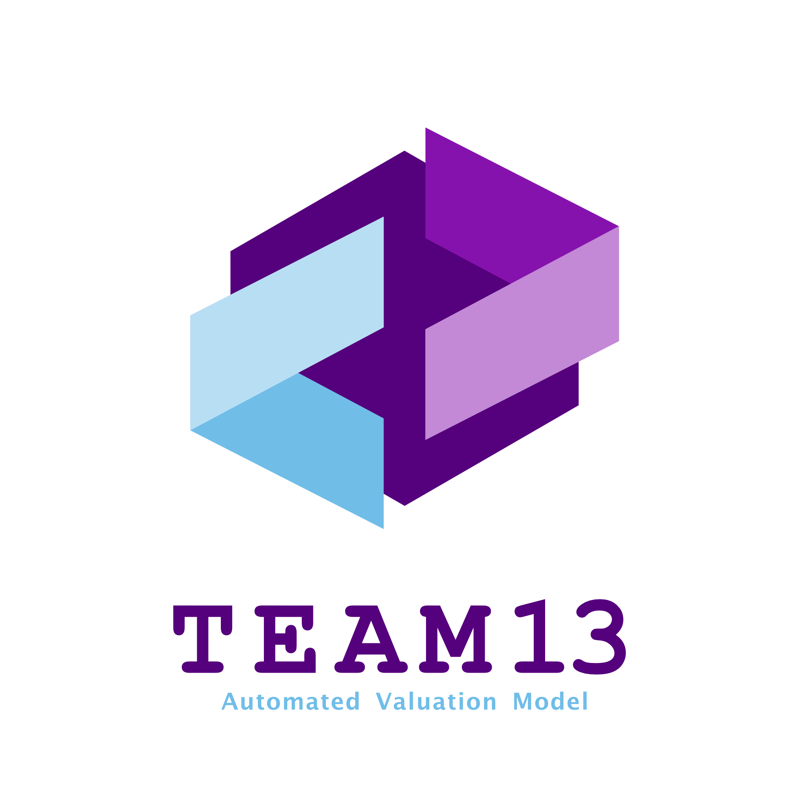

# **Deployment Guide**


<span > 
     
     
     
    
    
</span>

<p></p>


Please follow this deployment guide to configure the environment and start the application.

***

## Table of Contents
1. [Environment Information](#environment-information)
   1. [Virtual Environment Manager](#1virtual-environment-manager)
   2. [Packages](#2packages)
2. [Create and setup virtual environment](#create-and-setup-virtual-environment)
3. [Install packages](#install-packages)
   1. [For UNIX (macOS and Linux) users](#for-unix-macos-and-linux-users)
   2. [For Windows users](#for-windows-users)
4. [Before Start App](#before-start-app)
5. [Start app](#start-app)

## **Environment Information**
### 1.Virtual Environment Manager
It is recommended to use a virtual environment and use conda as the manager. This guide will use conda as the environment management tool.

If you decide to use conda, make sure only use conda to install packages. DO NOT use conda and pip at the same time, this will cause inaccessible dependency conflicts.

### 2.Packages
This project uses Python and the following packages are needed (if you do not need LLM feature, then you only need to install the basic dependencies):
- Basic dependencies
    * flask=2.2.2
    * numpy=1.26.9
    * pandas=2.1.1
    * scikit-learn=1.3.0 (conda-forge)
    * xgboost=2.0.3 (conda-forge)
    * lightgbm=4.1.0
    * mapie=0.8.2 (conda-forge)
    * joblib=1.2.0
    * weasyprint=61.2 (conda-forge) (macOS and Linux only!)
    * pdfkit=1.0.0 (pip) (Windows only!)
- Advanced dependencies
    * torch=1.13.1
    * transformers=4.37.1 (conda-forge)
- Unit-Test dependencies
    * pytest=8.1.1 (conda-forge)

Please note that the requirements.txt and environment.yml is only for development purpose and macOS x86_64 only.


## Create and setup virtual environment:
First create a new env.
```shell
conda create --name AVM python=3.9
```
You can use other python version, but python 3.9 is recommended and pre-tested.

And activate conda env by:
```shell
conda activate AVM
```

## Install packages
Same version and source channel is recommended and pre-tested. The following commands only for basic user (exclude torch and transformers).

### For UNIX (macOS and Linux) users
Use the following commands to complete the installation of all dependencies:
```shell
conda install flask=2.2.2 pandas=2.1.1
conda install scikit-learn=1.3.0 xgboost=2.0.3 lightgbm=4.1.0 mapie=0.8.2 joblib=1.2.0 weasyprint=61.2 -c conda-forge
```

### For Windows users
#### 1. Install wkhtmltopdf
##### 1.1. Setup wkhtmltopdf
You should download and install this tool before setup python related dependencies.
Simply download exe file from [website](https://wkhtmltopdf.org/downloads.html), and install.

##### 1.2. Setup system path
Add wkhtmltopdf installed path to your system path. If it was installed with default settings, the path should be:
```shell
C:\Program Files\wkhtmltopdf\bin  # Replace with your path
```
#### 2. Install other packages
Use the following commands to complete the installation of python related dependencies:
```shell
conda install flask=2.2.2 pandas=2.1.1
conda install scikit-learn=1.3.0 xgboost=2.0.3 lightgbm=4.1.0 mapie=0.8.2 joblib=1.2.0 -c conda-forge
python -m pip install pdfkit==1.0.0
```


## **Before Start App**
### 1. Check object files
In versions 4.0 and newer, object files have been added to mainline tracking, so **no** additional configuration is required.\
You can check object files in following directory:
```shell
model/object/rev311
NLGen/class
```

### 2. Config working folders
In versions 4.0 and newer, the working folder will be automatically configured and checked by the program, so you **do not need to configure it manually**.

### 3. Check Import
In versions 4.0 and newer, the program will **automatically** check the import of all dependent packages. If there are missing dependencies, an exception prompt will be provided in the terminal, and the program will exit automatically. If you encounter such problems, please follow the prompts to check the dependency installation.

### 4. Set host and port
The host and port is set as local (127.0.0.1:5000) as default. If you want to deploy this software to real server, you must change the host and port settings in the last line of __app.py__.

For general purpose, set host to "0.0.0.0" and port to "80" (http) or port "443" (https).\
Here is the example:
```python
app.run(debug=False) # default setting
app.run(host="0.0.0.0", port=80, debug=False) # http setting
```

## **Start app**
The start point of this application is _app.py_. 
Make sure conda env is activated:
```shell
conda activate AVM # replace AVM to your env name.
```
Assuming you are in the root directory, use this command to start the app:
```shell
cd Interface
python app.py
```
**DO NOT** directly start app in root directory:
```shell
python Interface/app.py # DO NOT directly start app in root directory
```

If the dependencies and project configuration are normal, it has been successfully started.