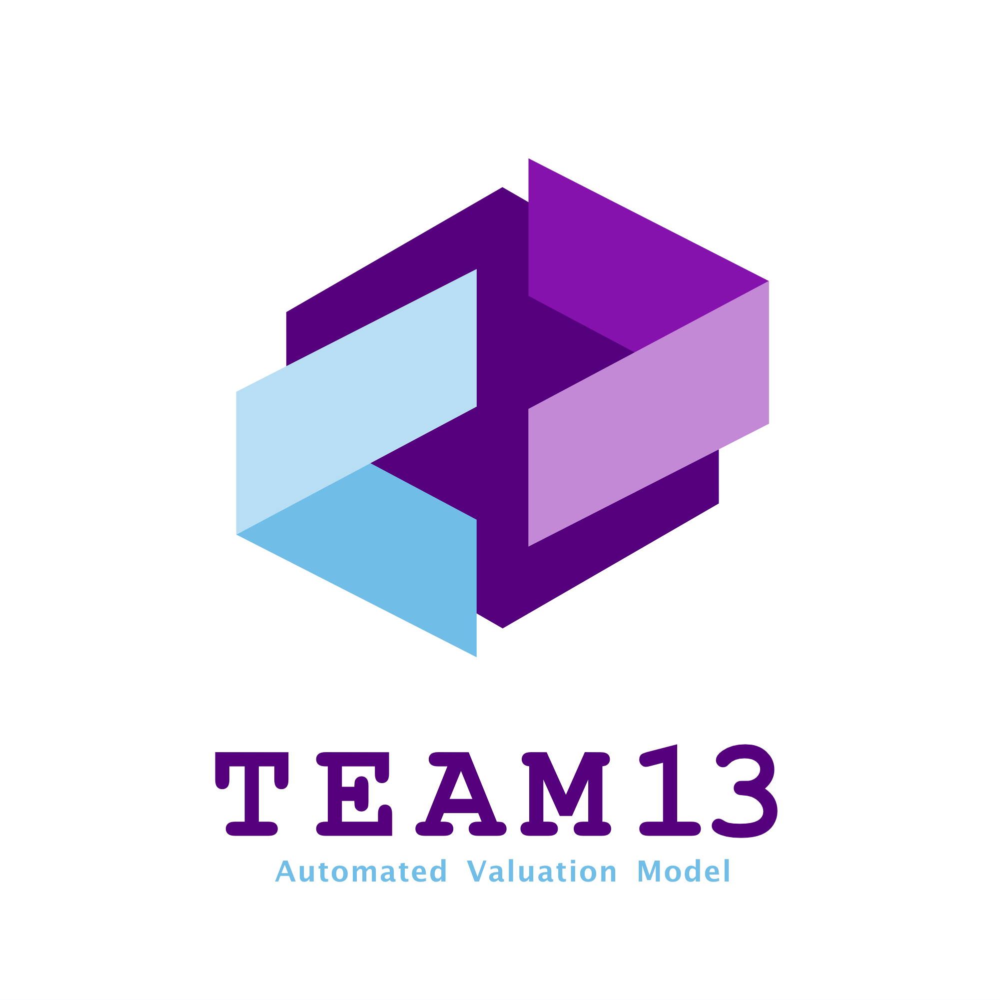

# **This is Main repo for AVM Project.** 


[](https://git.io/typing-svg)

[](https://git.io/typing-svg)

<span > 
     
     
     
</span>



***

## **TODO**
- **Transformers**
- **Model optimize**
    * classifier + regressor

## **Environment**
### Packages
This project uses Python and the following packages are needed:
* torch
* transformers
* numpy
* pandas
* scikit-learn
* matplotlib
* flask
* joblib

### Virtual Environment
It is recommended to use a virtual environment and use conda as the manager.

Create a virtual environment:
```shell
conda create --name AVM python=3.9
```
Then install the packages, if you have Nvidia GPU, you need to install Nvidia CUDA toolkits first and then install torch-cuda version.

## **Object Files**
Create:

```python
import joblib

joblib.dump(object, "path")
```

Load and use:
```python
import joblib

my_object = joblib.load("path")
```